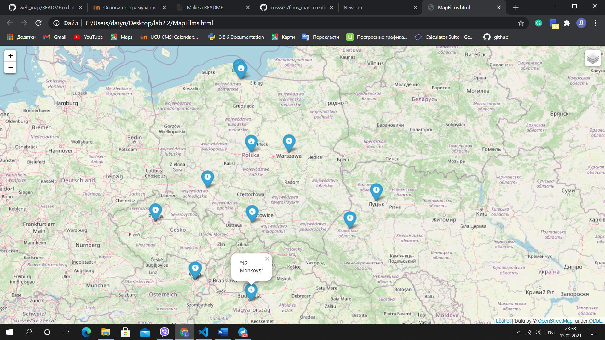

NAME 
films_map 

Description
This module works with the database of films, their year and location of
directing. Creates map with 3 layers which shows 10 films produced in the
year the user has chosen and that are located the closest
to the user's location.
In this module I use short base "small_locations.list", but it also works  for big base "locations.list"(it'll take much time).

Structure 
Consists of 5 functions and main. 

EXAMPLE OF USAGE

RESULT

